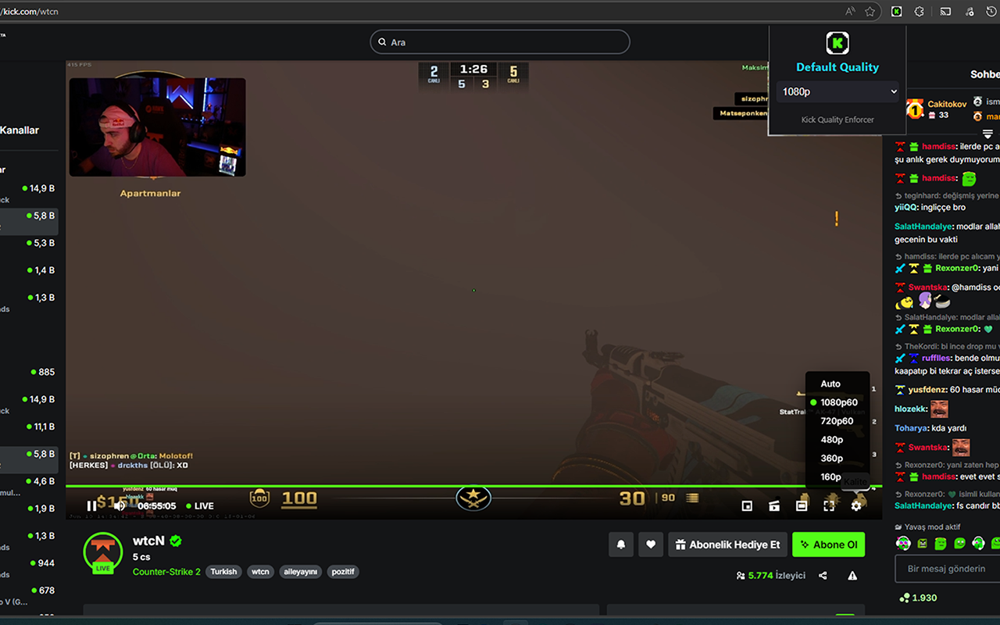
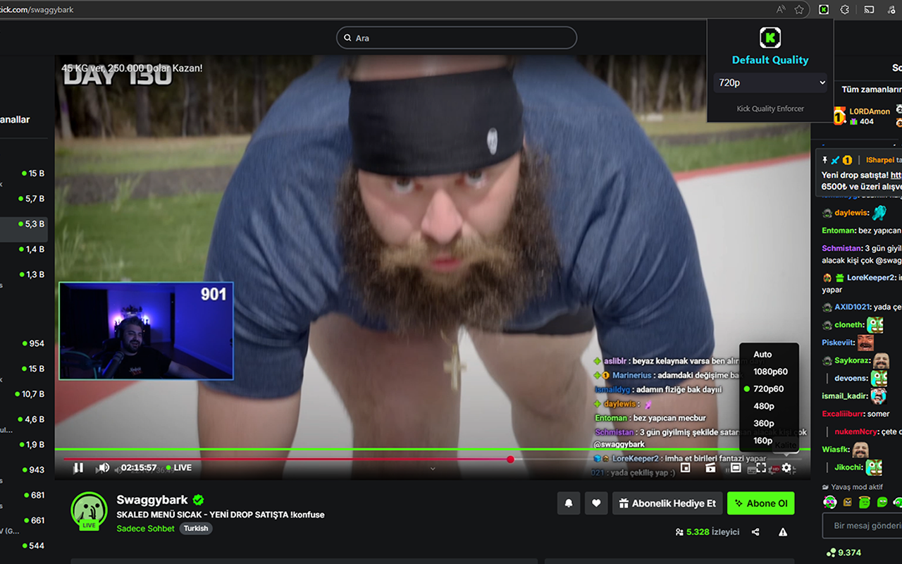

# Kick Quality Enforcer

A simple and lightweight Chrome extension that automatically sets your preferred stream quality on [Kick.com](https://kick.com).

## Features

- **Auto Quality:** Automatically applies your chosen stream quality (1080p, 720p, etc.) every time you visit Kick.com.
- **Easy to Use:** Select your default quality from the extension popup.
- **Remembers Your Choice:** Your preference is saved and instantly applied on every stream.
- **Open Source & Privacy-Friendly:** No tracking, no ads, just works!

## Installation

**From Chrome Web Store:**  
👉 [Install Kick Quality Enforcer](https://chromewebstore.google.com/detail/kick-quality-enforcer/ebbnoanfkddbmlhmldlpjdjpfodkimco?hl=en)

**Manual Installation:**
1. Clone or download this repository.
2. Go to `chrome://extensions/` in your browser.
3. Enable **Developer mode** (top right).
4. Click **Load unpacked** and select the extension folder.

## How It Works

- On every visit to Kick.com, the extension sets the stream quality to your saved preference.
- You can change your preferred quality anytime from the popup.

## Screenshots

 <!-- Add a screenshot if you have one -->
 <!-- Add a screenshot if you have one -->

## Contributing

Pull requests and suggestions are welcome! For major changes, please open an issue first.

## License

MIT

---

**Enjoy seamless streaming on
